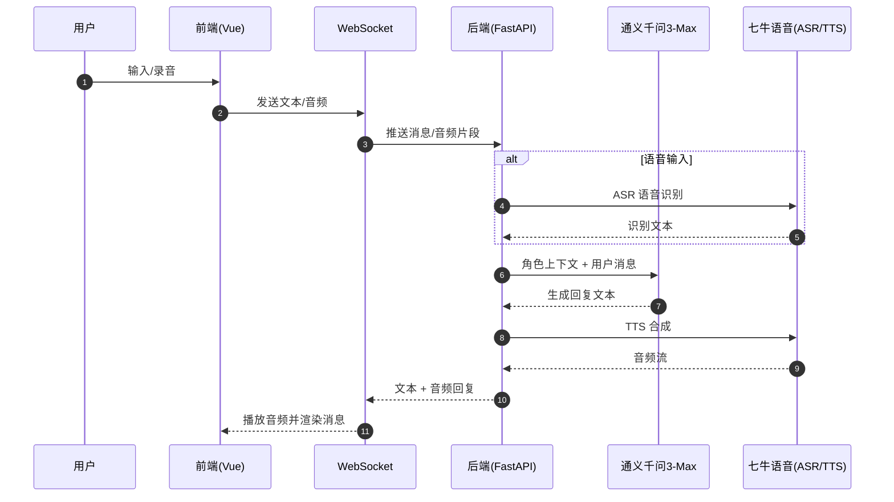
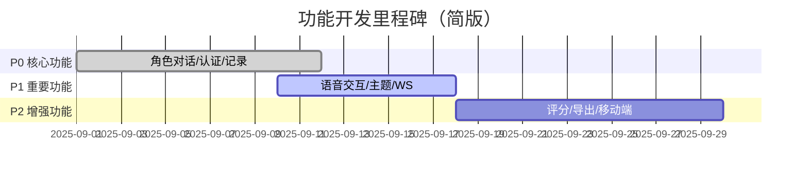
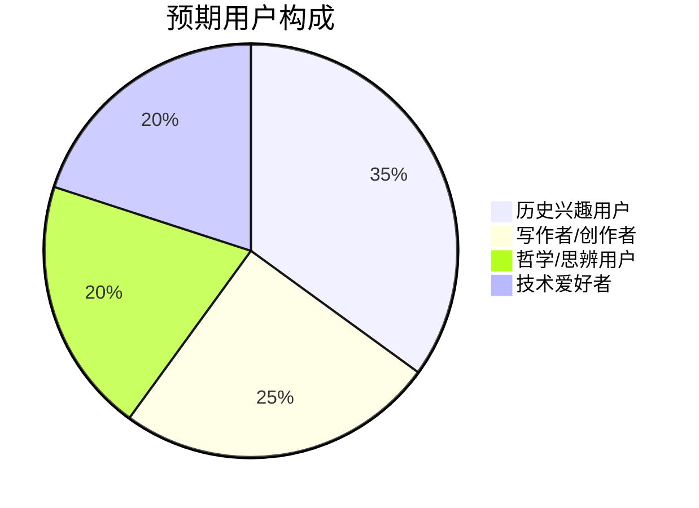

```

```

# AI角色扮演聊天系统

一个基于AI的角色扮演聊天网站，可以与历史人物、文学角色进行对话。使用FastAPI + Vue3开发，集成了阿里云百炼和七牛云语音服务。

## 项目介绍

这是一个AI角色扮演聊天系统，可以和历史人物、文学角色进行对话。项目主要用于学习和实践前后端开发技术。

### 目标用户
- 对历史人物感兴趣的用户
- 需要创作灵感的写作者  
- 喜欢哲学思辨的用户
- 对AI聊天感兴趣的技术爱好者

### 用户痛点
- 传统学习方式枯燥，缺乏互动性
- 创作时缺乏灵感和指导
- 缺乏深度思考的对话伙伴
- 想体验与历史人物对话的感觉

### 主要功能
- 与AI角色进行文本对话
- 语音交互（语音识别+语音合成）
- 用户注册登录
- 聊天记录保存
- 角色收藏功能

## 可视化概览

```mermaid
flowchart LR
  subgraph Frontend [前端 Vue3]
    FE[Vue3 应用]
  end

  subgraph Backend [后端 FastAPI]
    BE[FastAPI 应用]
    AI[AIService (通义千问3-Max)]
    VS[VoiceService (七牛云 ASR/TTS)]
    DB[(SQLite 数据库)]
  end

  FE -- Axios/HTTP --> BE
  FE -- WebSocket --> BE
  BE -- Prompt/上下文 --> AI
  BE -- ASR/TTS --> VS
  BE <---> DB
```







## 功能规划

### 核心功能（已实现）
1. **角色对话系统** - 与AI角色进行文本和语音对话
2. **用户认证系统** - 注册、登录、个人资料管理
3. **角色技能系统** - 每个角色的专属技能和能力
4. **聊天记录管理** - 保存和查看历史对话

### 重要功能（已实现）
1. **语音交互** - ASR语音识别 + TTS语音合成
2. **角色收藏系统** - 收藏喜欢的角色，快速访问
3. **主题切换** - 支持亮色/暗色主题
4. **WebSocket实时通信** - 低延迟的实时对话体验

### 计划功能
1. **角色评分系统** - 用户对角色表现进行评分
2. **对话导出功能** - 导出聊天记录为文本或PDF
3. **更多角色添加** - 扩展角色库
4. **移动端适配优化** - 更好的移动端体验

## 技术选型

### AI模型选择：阿里云通义千问3-Max

#### 对比分析
- **通义千问3-Max**：中文理解好、角色扮演能力强、成本适中
- **GPT-4**：综合能力强但成本高、API限制多
- **Claude-3**：逻辑推理强但中文支持一般
- **文心一言**：中文理解好但角色扮演能力一般

#### 选择理由
1. **中文优化**：通义千问在中文理解和表达方面表现优秀
2. **角色扮演能力**：能够很好地维持角色特征和一致性
3. **成本效益**：相比GPT-4成本更低，适合项目开发
4. **API稳定性**：阿里云提供稳定的API服务
5. **本土化支持**：更好的中文文化背景理解

### 语音服务选择：七牛云语音服务
- **ASR**：语音识别，将用户语音转换为文本
- **TTS**：语音合成，将AI回复转换为语音

### 技术栈
- **后端**：FastAPI + SQLite + WebSocket
- **前端**：Vue3 + Axios
- **部署**：本地开发环境

## 角色设计

目前包含5个角色，每个角色都有不同的性格和知识背景：

### 哈利波特
- **魔法知识** - 解答魔法相关问题
- **故事创作** - 创作魔法世界的故事
- **人生建议** - 基于勇气和友谊的建议
- **问答解惑** - 魔法史和咒语知识

### 苏格拉底
- **哲学思辨** - 深度哲学讨论
- **智慧建议** - 基于哲学智慧的人生指导
- **深度问答** - 苏格拉底式问答法
- **逻辑推理** - 帮助理清思维逻辑

### 爱因斯坦
- **科学解释** - 物理学和科学知识
- **创新思维** - 科学创新和问题解决
- **教育指导** - 科学学习方法
- **哲学思考** - 科学哲学思考

### 莎士比亚
- **文学创作** - 诗歌和戏剧创作
- **情感分析** - 人性情感分析
- **语言艺术** - 优美的语言表达
- **人生感悟** - 基于文学的人生智慧

### 达芬奇
- **艺术指导** - 绘画和艺术创作
- **科学解释** - 多领域科学知识
- **创新设计** - 工程和发明设计
- **观察分析** - 敏锐的观察和分析

## AI角色技能扩展

除了基础的语音聊天功能，每个AI角色还具备以下技能：

### 通用技能
1. **情感理解** - 识别用户情绪，提供相应的回应
2. **上下文记忆** - 记住对话历史，保持连贯性
3. **个性化适应** - 根据用户偏好调整对话风格
4. **知识更新** - 定期更新知识库，保持信息时效性

### 角色专属技能扩展

#### 哈利波特
- **魔法咒语教学** - 教授魔法咒语和施法技巧
- **魔法史讲解** - 详细讲解魔法世界的历史事件
- **友谊指导** - 基于友谊和勇气的价值观指导
- **冒险故事创作** - 创作魔法世界的冒险故事

#### 苏格拉底
- **哲学思辨引导** - 引导用户进行深度哲学思考
- **逻辑推理训练** - 训练用户的逻辑思维能力
- **道德伦理讨论** - 探讨道德和伦理问题
- **智慧格言生成** - 生成富有哲理的格言警句

#### 爱因斯坦
- **科学原理解释** - 用通俗易懂的方式解释复杂科学原理
- **创新思维启发** - 启发用户的创新思维
- **物理实验设计** - 设计有趣的物理实验
- **科学史讲解** - 讲解科学发展历程

#### 莎士比亚
- **诗歌创作指导** - 指导用户进行诗歌创作
- **戏剧表演建议** - 提供戏剧表演技巧
- **语言艺术教学** - 教授优美的语言表达技巧
- **文学鉴赏** - 进行文学作品鉴赏和分析

#### 达芬奇
- **艺术创作指导** - 指导绘画和艺术创作
- **工程设计思维** - 教授工程设计和创新思维
- **观察力训练** - 训练用户的观察和分析能力
- **跨领域知识整合** - 展示如何整合不同领域的知识

## 功能特点

### 🎭 丰富的角色库

- **哈利波特** - 魔法世界的年轻巫师，勇敢善良
- **苏格拉底** - 古希腊哲学家，以苏格拉底式问答法闻名
- **爱因斯坦** - 伟大的物理学家，相对论的创立者
- **莎士比亚** - 英国文学巨匠，戏剧大师
- **达芬奇** - 文艺复兴时期的全才，画家、发明家、科学家

### 🔐 用户认证系统

- **用户注册登录** - 安全的用户账户管理
- **JWT令牌认证** - 安全的身份验证机制
- **个人资料管理** - 用户信息维护和更新

### 🗣️ 多种交互方式

- **文本聊天** - 实时文本对话
- **语音聊天** - 语音识别和TTS语音合成
- **WebSocket实时通信** - 低延迟的实时对话体验

### 🎯 角色专属技能

每个角色都具备独特的技能：

#### 哈利波特

- 魔法知识 - 解答魔法相关问题
- 故事创作 - 创作魔法世界的故事
- 人生建议 - 基于勇气和友谊的建议
- 问答解惑 - 魔法史和咒语知识

#### 苏格拉底

- 哲学思辨 - 深度哲学讨论
- 智慧建议 - 基于哲学智慧的人生指导
- 深度问答 - 苏格拉底式问答法
- 逻辑推理 - 帮助理清思维逻辑

#### 爱因斯坦

- 科学解释 - 物理学和科学知识
- 创新思维 - 科学创新和问题解决
- 教育指导 - 科学学习方法
- 哲学思考 - 科学哲学思考

#### 莎士比亚

- 文学创作 - 诗歌和戏剧创作
- 情感分析 - 人性情感分析
- 语言艺术 - 优美的语言表达
- 人生感悟 - 基于文学的人生智慧

#### 达芬奇

- 艺术指导 - 绘画和艺术创作
- 科学解释 - 多领域科学知识
- 创新设计 - 工程和发明设计
- 观察分析 - 敏锐的观察和分析

## 技术架构

### 后端技术栈

- **FastAPI** - 现代、快速的Python Web框架
- **SQLite** - 轻量级数据库
- **WebSocket** - 实时双向通信
- **阿里云百炼平台** - AI大模型服务
- **通义千问3-Max-Preview** - 强大的中文大语言模型

### 前端技术栈

- **Vue 3** - 渐进式JavaScript框架
- **Axios** - HTTP客户端
- **WebSocket API** - 实时通信
- **响应式设计** - 适配各种设备

### 核心服务

- **AI服务** - 集成阿里云百炼平台，实现角色对话
- **语音服务** - 语音识别和TTS语音合成
- **角色管理** - 角色数据管理和技能调用
- **数据库管理** - 聊天记录和用户数据存储

## 安装和运行

### 环境要求

- Python 3.10+
- Windows 10/11（或其他能运行 Python 的系统）

### 安装步骤（已在仓库中提供自动启动脚本）

1. 克隆项目

```bash
git clone https://github.com/echo-c-c/-demo.git
cd -demo
```

2. 安装依赖

```bash
pip install -r requirements.txt
```

3. 配置环境变量（不要把真实密钥写进仓库）

- 创建 `.env` 文件，并按需填写：

```
# 阿里云百炼平台API密钥 (必需)
ALIBABA_CLOUD_API_KEY=sk-xxxxxxxxxxxxxxxxxxxxxxxxxxxxxxxx

# 七牛云语音服务配置 (可选，用于语音功能)
QINIU_BASE_URL=https://openai.qiniu.com/v1
QINIU_TTS_KEY=sk-xxxxxxxxxxxxxxxxxxxxxxxxxxxxxxxx

# JWT密钥 (用于用户认证，请修改为随机字符串)
JWT_SECRET=your-secret-key-here-please-change-me

# 数据库配置
DATABASE_URL=sqlite:///./chat_database.db

# 调试模式
DEBUG=True
```

4. 启动服务

```bash
python run.py
```

5. 访问应用：
   打开浏览器 `http://localhost:8080` (默认端口8080，如果被占用会自动尝试其他端口)

## API接口

### 角色相关

- `GET /api/characters` - 获取所有角色
- `GET /api/characters/search?query={query}` - 搜索角色
- `GET /api/characters/{character_id}` - 获取特定角色信息

### 聊天相关

- `POST /api/chat/text` - 文本聊天
- `POST /api/chat/voice` - 语音聊天
- `WebSocket /ws/{character_id}` - 实时聊天
- `GET /api/chat/history/{character_id}` - 获取聊天历史

### 技能相关

- `POST /api/characters/{character_id}/skills/{skill_name}` - 使用角色技能

## 使用说明

### 基本使用

1. 在左侧角色列表中选择感兴趣的角色
2. 在聊天框中输入消息开始对话
3. 使用角色专属技能获得更专业的回答

### 技能使用

1. 点击角色技能按钮
2. 根据提示输入相关参数
3. 获得基于角色背景的专业回答

### 语音功能（ASR + TTS + WebSocket通话）

1. 选择角色后，点击右下角的麦克风悬浮按钮开始录音
2. 停止录音后，前端会将音频通过 WebSocket 发送至后端，后端完成 ASR → LLM → TTS 流程
3. 前端自动播放 AI 语音回复，同时在消息区显示识别文本与回复文本

## 项目结构

```
ai-roleplay-chat/
├── backend/
│   ├── main.py              # FastAPI主应用
│   ├── ai_service.py        # AI服务集成
│   ├── voice_service.py     # 语音服务
│   ├── database.py          # 数据库管理
│   ├── character_manager.py # 角色管理
│   ├── auth_service.py      # 认证服务
│   └── chat_database.db     # SQLite数据库
├── frontend/
│   ├── index.html           # Vue前端页面
│   └── images/
│       └── characters/      # 角色图片资源
│           ├── harry_potter.jpg
│           ├── socrates.jpg
│           ├── einstein.jpg
│           ├── shakespeare.jpg
│           └── leonardo_da_vinci.jpg
├── requirements.txt         # Python依赖
├── run.py                   # 启动脚本
├── .env                     # 环境变量配置
└── README.md               # 项目说明
```

## 开发计划

### 已完成功能

- ✅ 基础角色系统、角色技能（含"魔法知识"等）
- ✅ 阿里云百炼（通义千问3）对话集成
- ✅ 用户注册/登录、JWT 鉴权
- ✅ 聊天记录、收藏、用户设置、通知面板
- ✅ 主题切换（亮/暗/自动）、整体UI重构
- ✅ 语音识别（ASR）与语音合成（TTS）整合、语音通话
- ✅ 角色图片资源集成（高质量角色头像）
- ✅ 前端认证问题修复（401错误处理）
- ✅ 环境变量配置优化
- ✅ 静态文件服务配置

### 最新更新 (v1.1.0)

- 🆕 集成高质量角色图片资源
- 🆕 优化前端认证流程
- 🆕 改进错误处理和用户体验
- 🆕 完善环境变量配置
- 🆕 静态文件服务优化

### 规划项

- 🔄 更丰富的角色与技能
- 🔄 更完善的消息搜索与导出
- 🔄 评分与反馈体系
- 🔄 多语言支持
- 🔄 移动端适配优化

## 故障排除

### 常见问题

1. **端口权限问题 (WinError 10013)**
   - 默认使用8080端口，避免Windows权限问题
   - 如果8080端口被占用，脚本会自动尝试其他端口
   - 可以手动运行: `cd backend && python -m uvicorn main:app --host 127.0.0.1 --port 8080`

2. **API调用401错误**
   - 确保已正确配置 `ALIBABA_CLOUD_API_KEY`
   - 检查 `.env` 文件是否存在且格式正确
   - 重启服务器以加载新的环境变量

3. **角色图片无法显示**
   - 确保图片文件存在于 `frontend/images/characters/` 目录
   - 检查静态文件服务配置是否正确

4. **语音功能无法使用**
   - 确保已配置 `QINIU_TTS_KEY`
   - 检查浏览器是否支持WebRTC
   - 确保在HTTPS环境下使用（语音功能需要安全上下文）

5. **用户认证问题**
   - 清除浏览器本地存储
   - 检查JWT密钥配置
   - 确保数据库文件权限正确

### 获取帮助

如果遇到其他问题，请：
1. 查看浏览器控制台错误信息
2. 检查服务器日志输出
3. 提交Issue到GitHub仓库

## 贡献指南

欢迎提交Issue和Pull Request来改进这个项目！

## 许可证

MIT License

## 联系方式

如有问题或建议，请通过以下方式联系：

- 邮箱：2012997697@qq.com
- GitHub：echo-c-c
